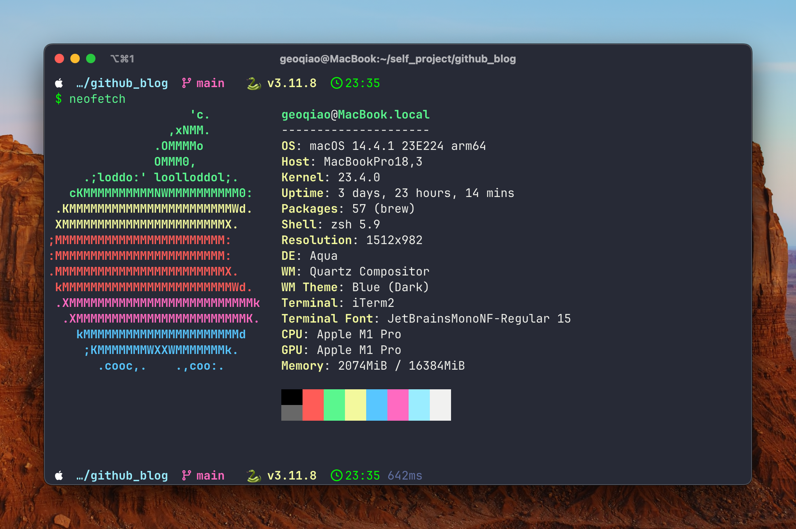

# Starship theme for zsh

This is a starship theme configuration for my own use.

It works just like the following:

## What is the configuration used in the image?

**Terminal Emulator**: iTerm2

**iTerm2 Theme**: Minimal

**Color Scheme**: Snazzy

**Font**:JetBrainsMonoNF-Regular 15

**Shell**: Zsh

**Configuration**: starship.toml in this repo
