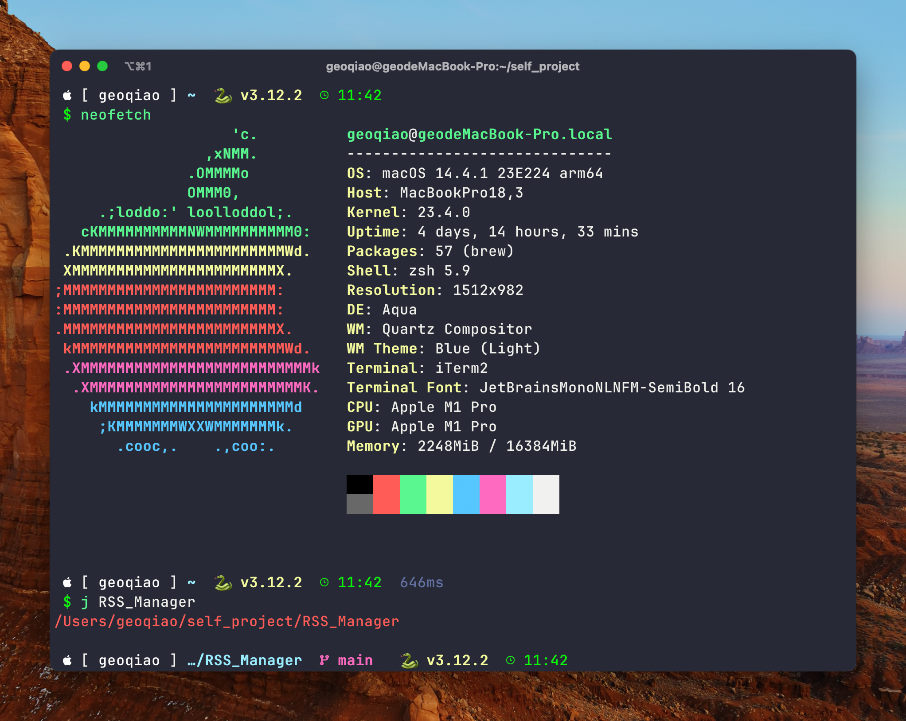

# Starship theme for zsh

This is a starship theme configuration for my own use.

It works just like the following:

## What is the configuration used in the image?

Terminal Emulator: iTerm2
Theme: Minimal
Color Scheme: Snazzy
Font:JetBrainsMonoNLNFM-SemiBold 16
Shell: zsh
Configuration: starship.toml in this repo
